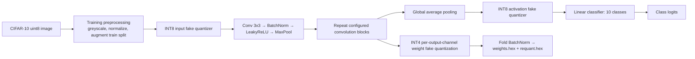

# Quantized CIFAR-10 CNN Hardware Export

This repository trains a small CNN on CIFAR-10 with quantization-aware training (QAT), then exports model parameters and a deterministic input image for hardware integration. The default configuration uses one-channel (greyscale) CIFAR-10 inputs, INT4 weights, and INT8 activation boundaries.

## Quick start

Prerequisite: Python 3.10 or newer with `venv` support, GNU Make, and an internet connection for the first CIFAR-10 download.

```sh
make install  # creates .venv and installs requirements.txt
make data     # downloads CIFAR-10 train and test sets into data/
make image    # produces the sample image .hex, .coe, and .S files
make train    # trains INT4 QAT and exports layer-1 verification vectors
make export   # re-exports layer-1 vectors from an existing INT4 checkpoint
```

For a complete first run, use `make pipeline`. Training uses the values in `config.yaml` and can take considerable time on a CPU. The default `50` epochs is intentional for a meaningful training run; lower `train.epochs` temporarily for a smoke test.

Run `make help` to list all targets. `make export` re-evaluates and exports from `models/INT4/golden_model_qat_INT4.pt` without retraining. `make export-model` remains an alias. If the checkpoint is missing, the pipeline starts a training run.

## What each command does

| Command | Purpose | Main outputs |
| --- | --- | --- |
| `make install` | Creates `.venv` when absent and installs Python packages. | `.venv/` |
| `make data` | Fetches both CIFAR-10 splits before training. Safe to rerun. | `data/cifar-10-batches-py/` |
| `make image` | Selects the configured test image and writes hardware-ready input data. | `artifacts/input/*.hex`, `*.coe`, `*.S`, `*.json` |
| `make train` | Trains from scratch, selects the best validation checkpoint, tests, and exports layer-1 verification vectors. | `models/INT4/*`, `artifacts/hardware/INT4/*` |
| `make export` | Loads an existing INT4 QAT checkpoint and regenerates layer-1 weights and output verification files. | `models/INT4/*`, `artifacts/hardware/INT4/*` |
| `make export-model` | Backwards-compatible alias for `make export`. | `artifacts/hardware/INT4/*` |
| `make clean-artifacts` | Removes all generated input and hardware artifacts. | — |

## Architecture



The default network has four active convolution blocks with channels `[16, 32, 64, 64]`. Every block preserves height and width in the convolution and halves it in `MaxPool2d`, so a `32×32` image becomes `16×16`, `8×8`, `4×4`, then `2×2`. Global average pooling turns the final `64×2×2` tensor into 64 values, followed by a 10-class linear classifier.

During training, the loader augments only the training split with random crop and horizontal flip. Validation and test images are deterministic. QAT keeps float tensors for optimization while simulating INT4 weights and symmetric INT8 activation tensors. When exporting, batch-normalization parameters are folded into the preceding convolution and bias/requantization constants are emitted for the integer hardware path.

## Configuration

`config.yaml` is the single place to alter model shape, training values, dataset location, and the fixed sample image export. Important keys:

| Key | Meaning |
| --- | --- |
| `model.greyscale` | Uses one CIFAR-10 greyscale channel when `true`; image artifact is therefore 1,024 bytes. Set `false` for RGB (3,072 bytes). |
| `model.layer_depth` / `model.channels` | Number of active convolution blocks and their output channels. `layer_depth` must not exceed `len(channels)`. |
| `model.use_bn` | Enables batch normalization. When enabled, the exporter folds it into convolution weights for hardware. |
| `train.epochs`, `learning_rate`, `batch_size` | Standard training controls. |
| `data.root` | CIFAR-10 storage directory. |
| `export.sample_index` | Fixed index within the CIFAR-10 **test** set. Use this to reproduce a particular hardware input. |
| `export.word_width_bits` | `.coe` and `.S` word width. Default `32` packs four bytes per word. |
| `export.hardware_dir` | Generated packed model-weight and inference-output bundle directory. |

Keep `model.greyscale` consistent with the input path implemented in hardware. The training loader normalizes images, while `make image` deliberately exports **raw unsigned uint8 pixels** before normalization. Hardware must implement the same greyscale conversion and normalization/quantization convention as the model input path before the first convolution. The accompanying JSON file records the image index, label, shape, type, and byte order.

## Input image files

For the default configuration, `make image` writes these files under `artifacts/input/`:

| File | Format and intended use |
| --- | --- |
| `cifar10_test_0000_gray_u8.hex` | One raw unsigned 8-bit greyscale pixel per line (`00`–`ff`), row-major image order. Suitable for `$readmemh` byte memories. |
| `cifar10_test_0000_gray_u8.coe` | Xilinx COE file using 32-bit words. The first pixel occupies the least-significant byte of the first word. |
| `cifar10_test_0000_gray_u8.S` | RISC-V/GNU assembly `.rodata` with `.word` directives using the same byte order as the COE file. |
| `cifar10_test_0000_gray_u8.json` | Reproducibility metadata, including the CIFAR-10 class label. |

The generated `.hex`, `.coe`, and `.S` represent exactly the same saved image. They differ only in container/packing format. The source is always the configured CIFAR-10 test sample, not a randomly augmented training image.

## Model export files

`make train` and `make export` first create the following under `models/INT4/`:

| File | Contents |
| --- | --- |
| `golden_model_qat_INT4.pt` | PyTorch QAT checkpoint; use this to resume/export the quantization-aware model. |
| `golden_model_hardware_INT4.pt` | PyTorch checkpoint with quantized values baked into ordinary layers. |
| `weights_INT4.hex` | Per-layer INT4 weight values represented in two's-complement hexadecimal bytes. |
| `requant_INT4.hex` | Fixed-point requant multipliers and folded-BN biases for convolution layers. |
| `scales_INT4.pt` | Per-output-channel weight scales used by QAT/export. |

`weights_INT4.hex` is the source export and includes readable layer comments. The packed hardware bundle below removes those comments, so every `.hex` line is actual memory data.

## Layer-1 verification bundle

`make export` writes only layer-1 verification files under `artifacts/hardware/INT4/`. The directory is recreated each time and contains exactly these three format folders: `hex/`, `coe/`, and `asm/`.

Each folder contains the same four vectors in its respective format:

| File stem | Contents |
| --- | --- |
| `input_layer1_qint8` | Model input after the deterministic test preprocessing and input fake quantizer: `1 × 32 × 32` signed INT8 values. |
| `weights_layer1_int4` | Folded and quantized first-convolution weights: `16 × 1 × 3 × 3` signed INT4 values stored as two's-complement bytes. |
| `output_layer1_intermediate_relu_int16` | First-layer integer MAC output after ReLU: INT8 input × INT4 weights + exported folded-BN bias, then `max(0, value)`, before requantization, scaling, or max-pool. Shape: `16 × 32 × 32` signed INT16 values. |
| `output_layer1_full_qint8` | Complete layer-1 result after folded convolution, LeakyReLU, `2 × 2` max-pool, and output activation scaling. Shape: `16 × 16 × 16` signed INT8 values. |

The input, weights, and full-output `.hex` files contain one signed two's-complement byte per line. The intermediate `.hex` file contains one signed INT16 two's-complement value per line. Its `.coe` and `.S` representations pack two INT16 values into each 32-bit word, with the first value in the least-significant 16 bits. The remaining `.coe` and `.S` files pack four bytes into each 32-bit word. This is a layer-1-only verification flow; it intentionally does not export later-layer tensors or classifier logits.

The raw unsigned image from `make image` is useful for image memory loading. The `input_layer1_qint8` verification vector is different: it applies the model's greyscale conversion, normalization, and input quantization, so it is the correct input to compare at the first hardware convolution boundary.

## Running without Make

```sh
python3 -m venv .venv
.venv/bin/python -m pip install -r requirements.txt
.venv/bin/python -m scripts.download_cifar10 --config config.yaml
.venv/bin/python -m scripts.export_cifar10_image --config config.yaml
.venv/bin/python main.py --train --quant-bits INT4
.venv/bin/python -m scripts.export_hardware_bundle --config config.yaml --quant-bits INT4
```

Use `--quant-bits INT8` or `--quant-bits FL32` with `main.py` to select another existing precision path. Those modes write to their own `models/INT8/` or `models/FL32/` directories.

## Repository map

| Path | Responsibility |
| --- | --- |
| `main.py` | Pipeline entry point: builds the model, trains or loads a QAT checkpoint, evaluates, and exports. |
| `config.yaml` | Model, data, training, and deterministic input-export configuration. |
| `data_loader.py` | CIFAR-10 download, preprocessing, augmentation, and train/validation/test loaders. |
| `model.py` | CNN definition and activation quantization boundaries. |
| `train.py` / `test.py` | Training loop, best validation checkpoint selection, and test evaluation. |
| `quant.py` | QAT wrappers, batch-norm folding, integer scaling, and model `.hex` exporters. |
| `scripts/download_cifar10.py` | Dataset-only setup command. |
| `scripts/export_cifar10_image.py` | Deterministic CIFAR-10 image `.hex`, `.coe`, and `.S` exporter. |
| `scripts/export_hardware_bundle.py` | Writes layer-1 input, weights, outputs with/without max-pool in all three formats. |
| `scripts/hex_to_coe.py`, `scripts/hex_to_assembly.py` | Older generic conversion utilities; prefer the image exporter for the documented input flow. |

## Notes and common issues

- The first `make data`/`make image` needs internet access. Later runs reuse files already in `data/`.
- On macOS, PyTorch automatically chooses Metal (`mps`) when available; otherwise the pipeline uses CUDA when available, then CPU.
- Delete or move `models/INT4/golden_model_qat_INT4.pt` when you deliberately want `make export` to start from a fresh checkpoint; normally use `make train` to retrain explicitly.
- Generated datasets, environments, checkpoints, and `artifacts/` are ignored by Git; source `.hex`, `.coe`, and `.S` files are not globally ignored.
- The model exporter must run before `convert_qat` changes QAT wrapper layers. `main.py` enforces that order.
